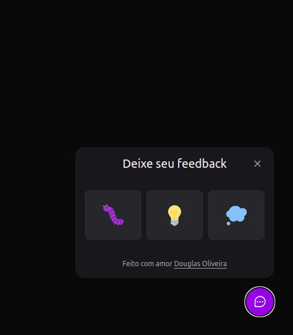

# NLW-Return-Impulse

<p align="center">
  
</p>

## 🧪 Tecnologias

Esse projeto foi desenvolvido com as seguintes tecnologias:

- [React](https://reactjs.org)
- [Vite](https://vitejs.dev/)
- [TypeScript](https://www.typescriptlang.org/)
- [Tailwindcss](https://tailwindcss.com/)


## 🚀 Como executar

Clone o projeto e acesse a pasta do mesmo.

```bash
$ git clone https://github.com/DouglasO-R/NLW-Return-Impulse.git
$ cd NLW-Return-Impulse
```

Para iniciá-lo, siga os passos abaixo:
```bash
# Instalar as dependências
$ yarn
# Iniciar o projeto
$ yarn start
```
O app estará disponível no seu browser pelo endereço http://localhost:3000.


## 💻 Projeto

Um Component Widget para feedback que pode ser utilizado em qualquer site.


Este é um projeto desenvolvido durante a **[Next Level Week Return](https://nextlevelweek.com/)**, apresentada dos dias 02 a 07 de Maio de 2022.


## 🔖 Layout

Você pode visualizar o layout do projeto através do link abaixo:

- [Layout Web](https://www.figma.com/file/CVdNQmU4DkMInSOcPOL1Xe/Feedback-Widget-(Community)?node-id=7%3A2) 

Lembrando que você precisa ter uma conta no [Figma](http://figma.com/).

## 📝 License

Esse projeto está sob a licença MIT. Veja o arquivo [LICENSE](LICENSE.md) para mais detalhes.
